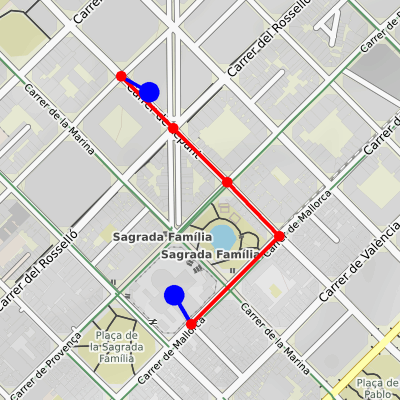
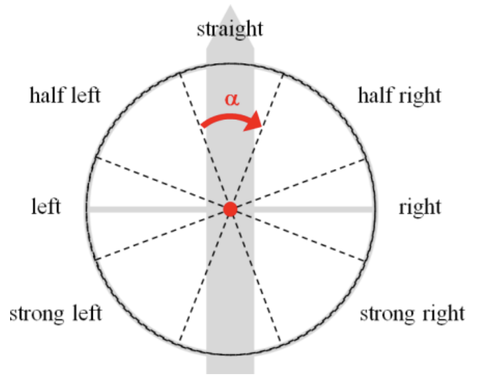
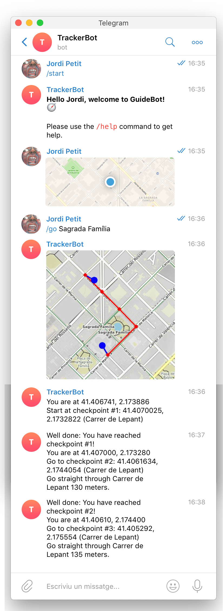

# GuideBot

No us perdeu més: GuideBot us ensenya el camí! 🧭


## Introducció

Aquesta pàgina descriu el projecte GuideBot, que correspon a la segona pràctica
del curs 2020 d'AP2 al GCED. La vostra tasca consisteix en implementar un Bot de
Telegram que permeti guiar als seus usuaris fins a la seva destinació a través d'un
mapa obtingut d'[Open Street Map](https://www.openstreetmap.org).


## Arquitectura del sistema

Els sistema consta dels mòduls següents:

- `guide.py` conté tot el codi relacionat amb l'adquisició i l'enmagatzematge de
  grafs corresponents a mapes i amb el càlcul de rutes.  Aquest mòdul no en sap res
  del bot.

- `bot.py` conté tot el codi relacionat amb el bot de Telegram i utilitza el
  mòdul `guide`. La seva tasca és reaccionar a les comandes i als
  canvis de localització dels usuaris per poder-los guiar.


## Funcionalitat del mòdul `guide`

El mòdul `guide` ha de contenir les funcions públiques següents:

- `download_graph(place)`: Descarrega un graf osmnx d'algun lloc
    (per exemple, "Barcelona, Spain") i el retorna.

- `save_graph(graph, filename)`: Desa el graf en un fitxer en format pickle.

- `load_graph(filename)`: Carrega un graf d'un fitxer en format pickle i el retorna.

- `print_graph(graph)`: Mostra el contingut d'un graf (per depurar).

- `get_directions(graph, source_location, destination_location)`:
    Retorna la millor ruta (*directions*) per anar d'un punt d'orígen a un punt de destí
    en un graf.
    Els dos punts es dónen a través de les seves coordenades (latitud, longitud).
    Més endavant es descriu el format de la ruta.

- `plot_directions(graph, source_location, destination_location, directions, filename, width=400, height=400)`:
    Dibuixa una ruta per anar d'un punt
    d'orígen a un punt de destí
    en un graf en un mapa en format PNG.

Les operacions de `download`, `load` i `save` són per accelerar la velocitat de càrrega dels grafs:
descarregar-los cada cop d'OpenSteetMap per xarxa és molt més lent que carregar-los localment.


## Rutes

Una ruta descriu com anar d'un punt d'orígen a un punt de destí en un graf i és
una llista de trams. Cada tram conté informació sobre el punt inicial (`src`),
el punt del mig (`mid`), el punt destí (`dst`) i més informacions com ara el nom
dels carrers entre aquests punts, la seva longitud, direcció relativa... per tal
d'informar a l'usuari que, des del punt inicial ha d'anar fins al punt mig i
d'allà, agafar el camí que porta fins al punt de destí.

Per exemple, en el mapa de Barcelona, aquesta podria ser la ruta per anar
de *Carrer de Lepant 330
(41.40674136015038, 2.1738860390977446)* a *Sagrada Familia
(41.4034789, 2.1744103330097055)* en moto elèctrica:

```python
[{'angle': None,
  'current_name': None,
  'dst': (41.4061634, 2.1744054),
  'length': None,
  'mid': (41.4070025, 2.1732822),
  'next_name': 'Carrer de Lepant',
  'src': (41.40674136015038, 2.1738860390977446)},
 {'angle': 0.40200000000001523,
  'current_name': 'Carrer de Lepant',
  'dst': (41.4052928, 2.1755545),
  'length': 132.215,
  'mid': (41.4061634, 2.1744054),
  'next_name': 'Carrer de Lepant',
  'src': (41.4070025, 2.1732822)},
 {'angle': 0.6809999999999832,
  'current_name': 'Carrer de Lepant',
  'dst': (41.4044287, 2.1766682),
  'length': 136.25400000000002,
  'mid': (41.4052928, 2.1755545),
  'next_name': 'Carrer de Lepant',
  'src': (41.4061634, 2.1744054)},
 {'angle': 88.957,
  'current_name': 'Carrer de Lepant',
  'dst': (41.4030085, 2.1747797),
  'length': 133.644,
  'mid': (41.4044287, 2.1766682),
  'next_name': 'Carrer de Mallorca',
  'src': (41.4052928, 2.1755545)},
 {'angle': None,
  'current_name': 'Carrer de Mallorca',
  'dst': (41.4034789, 2.1744103330097055),
  'length': 223.04499999999996,
  'mid': (41.4030085, 2.1747797),
  'next_name': None,
  'src': (41.4044287, 2.1766682)},
 {'angle': None,
  'current_name': None,
  'dst': None,
  'length': None,
  'mid': (41.4034789, 2.1744103330097055),
  'next_name': None,
  'src': (41.4030085, 2.1747797)}]
```

Aquest és el dibuix d'aquesta ruta:

<center></center>

Fixeu-vos que els extrems de la ruta no tenen perquè ser nodes del graf.
Per tant, caldrà buscar els nodes més propers a ells (o desenvolupar alguna
tècnica més òptima).

De fet, sou lliures de triar vosaltres mateixos la representació més adequada dels trams pels vostres propòsits. La idea important és que tot el càlcul de la ruta és fet per la funció `get_directions` per tal que el bot sigui el més senzill possible.


## Funcionalitat del mòdul `bot`

El bot de Telegram ha de donar suport a les comandes següents:

- `/start`: inicia la conversa.
- `/help`: ofereix ajuda sobre les comandes disponibles.
- `/author`: mostra el nom dels autors del projecte.
- `/go destí`: comença a guiar l'usuari per arrivar de la seva posició actual fins al punt de destí escollit.
   Per exemple: `/go Campus Nord`.
- `/where`: dóna la localització actual de l'usuari.
- `/cancel`: cancel·la el sistema de guia actiu.

El bot hauria de començar carregant un graf fixat (per exemple, el de
Barcelona).  A partir d'aquell moment esperarà connexions de diferents usuaris i
els ajudarà a arribar a la seva destinació tot calculant la ruta òptima per anar
des de la seva posició actual fins al seu destí. Totes les comandes han de
funcionar per a diferents usuaris alhora.

Per utilitzar el bot, els usuaris han de compartir-li la seva localització en
directe. D'aquesta forma, el bot anirà rebent actualitzacions sobre els seus
canvis de posició per poder-los guiar adequadament. Si no s'ha compartit la
localització, moltes de les comandes hauran d'assenyar l'error.

El sistema de guia escollit és el següent: Quan un usuari tria una destinació
(amb `/go`), el bot calcula la ruta òptima per arribar-hi des de la seva posició
actual i mostra la ruta en un mapa. També, el bot dóna la indicació del primer
tram i espera que l'usuari hagi arribat prop del seu punt del mig. Quan hi
arriba, li dóna la indicació del següent tram. I així fins arribar a la
destinació (o cancel·lar el sistema de guia). Fixeu-vos que el sistema descrit
força a seguir els trams precalculats: l'usuari no obtindrà la següent indicació
fins que no arribi al punt intermig esperat.

El sistema hauria de donar indicacions de gir adeqüades. Per exemple,
"gira a la dreta" o "gira lleugerament a l'esquerra". Aquí en teniu una proposta:

<center></center>
<br>

A continuació es dóna un exemple d'interacció:

<center></center>


## Llibreries

Utilitzeu les llibreries de Python següents:

- `networkx` per a manipular grafs.
- `osmnx` per a obtenir grafs de llocs.
- `haversine` per a calcular distàncies entre coordenades.
- `staticmap` per pintar mapes.
- `python-telegram-bot` per interactuar amb Telegram.

Totes es poden instal·lar amb `pip3 install`, però `osmnx` també requereix
instal·lar `spatialindex` (instal·lable amb `brew install spatialindex` en Mac o
`apt install spatialindex` en Ubuntu). També es poden instal·lar totes amb
Anaconda.

Podeu utilitzar lliurament altres llibreries estàndards de Python, però si no
són estàndards, heu de demanar permís als vostres professors (que segurament no
us el donaran).


## Fonts d'informació

Aquests enllaços us seran útils per fer el vostre projecte:

- [Lliçons de bots de Telegram](https://lliçons.jutge.org/python/telegram.html)

- [Lliçons de fitxers en Python](https://lliçons.jutge.org/python/fitxers-i-formats.html)

- [Tutorial de NetworkX](https://networkx.github.io/documentation/stable/tutorial.html)

- [Tutorial d'OSMnx](https://geoffboeing.com/2016/11/osmnx-python-street-networks/)


## Indicacions per treballar amb els grafs d'OSMnx

Els grafs d'OSMnx tenen molta informació. Per facilitar-vos la feina,
demaneu-los simplificats i calculeu les orientacions dels camins al carregar-los.
Per exemple:

```Python
graph = osmnx.graph_from_place("Berga, Spain", network_type='drive', simplify=True)
osmnx.geo_utils.add_edge_bearings(graph)
```

Aquesta és la manera de recórrer totes les arestes d'un graf:

```python
# for each node and its information...
for node1, info1 in graph.nodes.items():
    print(node1, info1)
    # for each adjacent node and its information...
    for node2, info2 in graph.adj[node1].items():
        print('    ', node2)
        # osmnx graphs are multigraphs, but we will just consider their first edge
        edge = info2[0]
        # we remove geometry information from edges because we don't need it and take a lot of space
        if 'geometry' in edge:
            del(edge['geometry'])
        print('        ', edge)
```

De forma molt infreqüent, els grafs d'OSMnx tenen multi-arestes. El codi
anterior les ignora tot quedant-se amb la primera aresta. Feu el mateix. El
codi anterior també elimina la geometria dels camins, ja que en aquest projecte
no ens interessa. Compte: a vegades hi ha sorpreses: carrers amb més d'un nom,
valors absents o nuls...


# Instruccions

## Equips

Podeu fer aquest projecte sols o en equips de dos. En cas de fer-lo en equip, la càrrega de treball dels dos membres de l'equip ha de ser semblant i el resultat final és responsabilitat d'ambdós. Cada membre de l'equip ha de saber què ha fet l'altre membre.

Els qui decidiu fer el segon projecte en un equip de 2 estudiants, envieu abans de les 23:59 del dia 24 d'abril un missatge al professor Jordi Petit amb aquestes característiques:

- des del compte oficial d'un dels dos membres,
- amb tema (subject) "Equips AP2",
- amb el nom dels dos estudiants de l'equip al cos del missatge,
- fent còpia (CC) al compte oficial de l'altre estudiant,

Si no es reb cap missatge d'equip per aquesta data, es considerarà que feu la pràctica sols. Si heu enviat aquest missatge, es considerarà que feu la pràctica junts (i no s'admetràn "divorcis").


## Lliurament

Heu de lliurar la vostra pràctica al Racó.
El termini de lliurament és el **divendres 5 de juny a les 23:59 CEST**.

Només heu de lliurar un fitxer ZIP que, al descomprimir-se,
generi els fitxers següents:

- `guide.py`,
- `bot.py`,
- `requirements.txt`,
- `README.md` i
- `*.png` si cal adjuntar imatges a la documentació.

Res més. Sense directoris ni subdirectoris.

Els vostres fitxers de codi en Python han de seguir
[les regles d'estíl PEP8](https://www.python.org/dev/peps/pep-0008/). Podeu
utilitzar el paquet `pep8` o http://pep8online.com/ per assegurar-vos
que seguiu aquestes regles d'estíl.
L'ús de tabuladors en el codi queda
prohibit (zero directe).

El projecte ha de contenir un fitxer `README.md`
que el documenti. Vegeu, per exemple, https://gist.github.com/PurpleBooth/109311bb0361f32d87a2.
Si us calen imatges al `README.md`, deseu-los com a fitxers PNG.

El projecte també ha de contenir un fitxer `requirements.txt`
amb les llibreries que utilitza el vostre projecte per poder-lo instal·lar.
Vegeu, per exemple, https://pip.pypa.io/en/stable/user_guide/#requirements-files.


## Consells

- Us suggerim seguir aquests passos:

    1. Estudieu com utilitzar els grafs de `networkx`.
    2. Mireu com es concreten a `osmnx`.  
    3. Implementeu primer el mòdul `guide` i proveu-lo.
    4. Estudieu com escriure un bot de Telegram i experimenteu separadament les parts que necessitareu.
    5. Implementeu el mòdul `bot` i proveu-lo.

  Documenteu el codi a mesura que l'escriviu.

- Passejar per la ciutat per provar el bot és massa pesat (i, de fet, pot estar prohibit a causa del confinament): Afegiu comandes al
  bot per poder depurar el programa només amb l'ordinador.  Per exemple, podeu
  crear una comanda per passar una localització falsa. De fet, intenteu provar-ho
  tot tant com pogueu fora de Telegram, perquè altrament s'hi perd molt de temps.

- L'enunciat deixa obertes moltes qüestions expressament (per exemple: què vol
  dir estar prou a prop d'un punt intermig?). Sou els responsables de prendre
  les vostres decisions de disseny i deixar-les reflectides adientment al codi i
  a la documentació.

- Podeu ampliar les capacitats del vostre projecte mentre manteniu les
  funcionalitats mínimes previstes en aquest enunciat. Ara bé, aviseu abans als
  vostres professors i deixeu-ho tot ben documentat.

- Per evitar problemes de còpies, no pengeu el vostre projecte en repositoris
  públics. Si us cal un repositori GIT, useu [GITLAB
  FIB](https://gitlab.fib.upc.edu/users/sign_in).


## Autors

Jordi Cortadella i Jordi Petit

Universitat Politècnica de Cataluna, 2020
